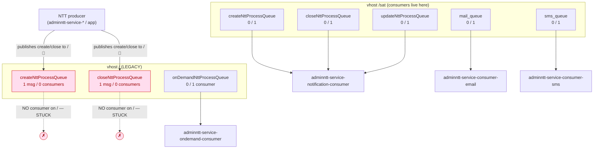
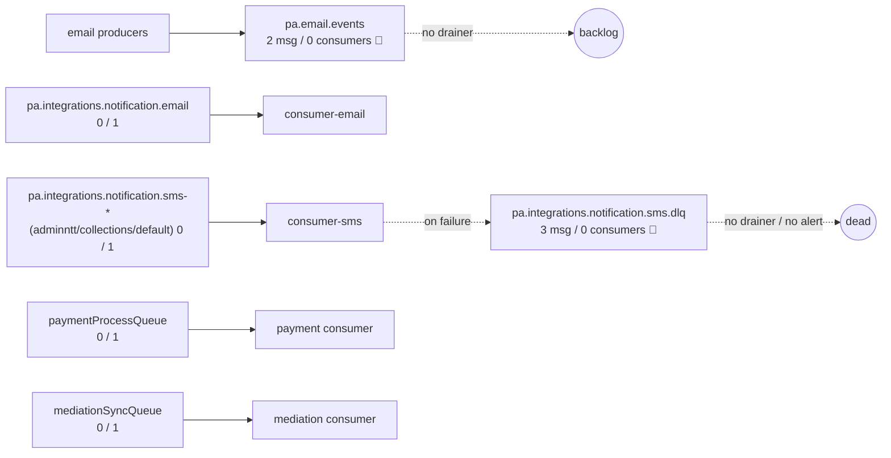

# Project Zeus — SAT critical-flow diagrams (D4)

Source: SAT **dev** cluster (ns `argocd`) + GitOps overlays, 2026-06-22.

**Legend / confidence:**
- **Solid edges = evidenced** from the cluster (services, ingress, RabbitMQ queues + consumer attachment).
- **Dashed edges + `(?)` = inferred** from naming/topology — **to confirm with the dev team** (need app code / config).
- 🔴 marks a confirmed defect (see `sat-analysis.md`).

---

## 0. SAT system context (the 4 domains + the buses)

```mermaid
flowchart LR
  user([POS / Operator / Browser])
  ing["Ingress\nk8s-&lt;env&gt;-sat.tigo.com.pa\n(single host, path-based)"]

  subgraph CR["Cash Register (cr-*)"]
    crf[cr-app-frontend]
    crb[cr-app-backend]
    crsvc["cr-service-* (12)\ngetpayments, getcustomerdebt,\nprocesspayments, cancel-payment,\ncash, config-*, getcashregisteramount"]
    cra[cr-service-auth]
  end
  subgraph IUC["IUC billing / SAP (iuc-*)"]
    iucf[iuc-app-frontend]
    iucb[iuc-app-backend]
    iucsvc["iuc-service-* + elt-processdata\ncheckdata, processsap, exporttofile,\nget-auxiliar, get-summary"]
  end
  subgraph NTT["AdminNTT (adminntt-*)"]
    nttf[adminntt-app-frontend]
    nttsvc["adminntt-service-* (queries,\ncatalogs, dashboards, reports)"]
    nttcons["consumers:\nconsumer-email, consumer-sms,\nnotification-consumer, ondemand-consumer"]
    nttetl["etl-*: procesos-glx, procesos-tytan,\ndirecciones-tytan, archivos-hfc-ftth"]
  end
  subgraph DSC["Digital Sale Closure"]
    dscf[digital-sale-closure-frontend]
    dscs[digital-sale-closure-services]
  end

  user --> ing
  ing --> crf & iucf & nttf & dscf
  crf -.->|HTTP (?)| crb
  crb -.->|HTTP (?)| crsvc
  crb -.-> cra

  pg[("PostgreSQL")]
  rmq{{"RabbitMQ\nvhosts: / , /sat , /int"}}

  crsvc --> pg
  iucsvc --> pg
  nttsvc --> pg
  nttcons --> pg
  crsvc -.->|publish (?)| rmq
  nttsvc -.->|publish (?)| rmq
  rmq --> nttcons
  iucsvc -.->|SAP (?)| sap[("SAP")]
  nttetl -.->|files / GLX / Tytan (?)| ext[("GLX / Tytan / HFC-FTTH")]
```

---

## 1. Cash-Register payment processing (most critical: money path)

Evidenced: services exist, each on its own ingress path; `paymentProcessQueue` (/int) has 1 consumer.
Inferred: the orchestration order and who publishes to `paymentProcessQueue`.

```mermaid
sequenceDiagram
  autonumber
  actor POS as POS / Cashier
  participant ING as Ingress
  participant FE as cr-app-frontend
  participant BE as cr-app-backend (?)
  participant AUTH as cr-service-auth
  participant DEBT as cr-service-getcustomerdebt
  participant PROC as cr-service-processpayments
  participant DB as PostgreSQL
  participant Q as RabbitMQ /int:paymentProcessQueue
  participant PAYC as paymentProcessQueue consumer (?)

  POS->>ING: HTTPS
  ING->>FE: route /cr-app-frontend
  FE->>AUTH: authenticate (?)
  AUTH-->>FE: token
  FE->>BE: submit payment (?)
  BE->>DEBT: get customer debt (?)
  DEBT->>DB: query
  DB-->>DEBT: balance
  DEBT-->>BE: amount due
  BE->>PROC: process payment (?)
  PROC->>DB: persist payment
  PROC->>Q: publish paymentProcessQueue (?)
  Q->>PAYC: deliver
  PAYC->>DB: post / reconcile (?)
  PROC-->>BE: result
  BE-->>FE: receipt
  FE-->>POS: confirmation

  Note over PROC,DB: 🔴 D1: logs are DEBUG/health noise — no txn id, account, amount, or result logged.\nA failed payment is NOT traceable from logs today.
  Note over PROC: 🔴 D3: HPA pinned 1/1; mem ~117% of request → OOM risk under load.
```

**To confirm with team:** Does `cr-app-backend` orchestrate the `cr-service-*` calls, or does the frontend call each
service directly via ingress? Who publishes to `paymentProcessQueue` and who consumes it (a cr-service or an
integraciones service)?

---

## 2. AdminNTT notification flow (2nd critical: customer comms) — shows the split-vhost bug

Evidenced: consumer attachment per vhost/queue (see `sat-analysis.md`). 🔴 = confirmed defect.



**🔴 The bug, visually:** producers publish create/close NTT events to vhost `/`, but the consumers are bound to
vhost `/sat`. Those events sit forever (1 msg each, 0 consumers). Fix = align producer and consumer on one vhost.

---

## 3. Notifications / integrations bus (/int) — DLQ backlog



**🔴** `pa.email.events` (2 stuck) and `...sms.dlq` (3 dead) have no consumer → silent failure accumulation.

---

## Open confirmations for the Monday session
1. CR: orchestration topology (BFF vs direct) + `paymentProcessQueue` producer/consumer ownership.
2. NTT: which service/config publishes to vhost `/` vs `/sat` (root cause of the split-vhost bug).
3. Who (if anyone) is supposed to drain `pa.email.events` and the DLQs; is there any alerting on queue depth?
4. IUC↔SAP and ETL↔(GLX/Tytan/HFC) external integration details (not yet probed — out of current scope).
